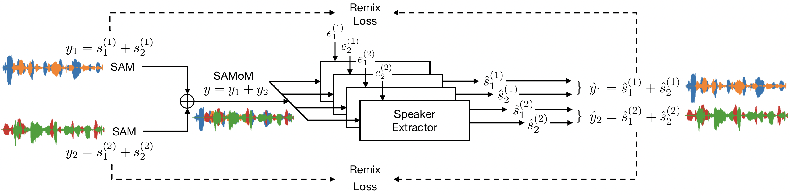

## Speaker-Aware Mixture of Mixtures Training for Weakly Supervised Speaker Extraction

Zifeng Zhao1, Rongzhi Gu1, Dongchao Yang1, Jinchuan Tian1, Yuexian Zou1, 2

1 Peking University

2 Peng Cheng Laboratory

### Introduction

This is a [demo](https://zhazhafon.github.io/demo-samom/) for our paper **_Speaker-Aware Mixture of Mixtures Training for Weakly Supervised Speaker Extraction_**. In the following, we will show the performance of both supervised training and the proposed weakly supervised training(SAMoM for short) for comparison.  

  

  
Block Diagram of the Proposed SAMoM Training

	

### Demo 1: Performance on Libri2Mix[2]

* **Sample 1: ( Female + Male ) => Female**

| 
Mixture
 | 
Baseline: Supervised Training
 | 
Ours: Weakly Supervised Training
 |
| :--- | :--- | :--- |
|<audio src="demo1_mix/2830-3979-0011_1580-141084-0010.wav" controls="controls">ERROR</audio>|<audio src="demo1_sup/2830-3979-0011_1580-141084-0010_s1.wav" controls="controls">ERROR</audio>|<audio src="demo1_samom/2830-3979-0011_1580-141084-0010_s1.wav" controls="controls">ERROR</audio>

<!--
* **Sample 1: ( Female + Male ) => Female**
    * **Mixture**
    <audio src="demo1_mix/2830-3979-0011_1580-141084-0010.wav" controls="controls">ERROR</audio>
    * **Baseline: Supervised Training**
    <audio src="demo1_sup/2830-3979-0011_1580-141084-0010_s1.wav" controls="controls">ERROR</audio>
    * **Ours: Weakly Supervised Training with SAMoM**
    <audio src="demo1_samom/2830-3979-0011_1580-141084-0010_s1.wav" controls="controls">ERROR</audio>

---
-->

* **Sample 2: ( Female + Male ) => Male**

| 
Mixture
 | 
Baseline: Supervised Training
 | 
Ours: Weakly Supervised Training
 |
| :--- | :--- | :--- |
|<audio src="demo1_mix/1320-122617-0035_121-121726-0009.wav" controls="controls">ERROR</audio>|<audio src="demo1_sup/1320-122617-0035_121-121726-0009_s0.wav" controls="controls">ERROR</audio>|<audio src="demo1_samom/1320-122617-0035_121-121726-0009_s0.wav" controls="controls">ERROR</audio>|

<!--
* **Sample 2: ( Female + Male ) => Male**
    * **Mixture**
     <audio src="demo1_mix/1320-122617-0035_121-121726-0009.wav" controls="controls">ERROR</audio>
    * **Baseline: Supervised Training**
    <audio src="demo1_sup/1320-122617-0035_121-121726-0009_s0.wav" controls="controls">ERROR</audio>
    * **Ours: Weakly Supervised Training with SAMoM**
    <audio src="demo1_samom/1320-122617-0035_121-121726-0009_s0.wav" controls="controls">ERROR</audio>

---
-->

* **Sample 3: ( Male + Male ) => Male**

| 
Mixture
 | 
Baseline: Supervised Training
 | 
Ours: Weakly Supervised Training
 |
| :--- | :--- | :--- |
|<audio src="demo1_mix/6930-75918-0007_1089-134691-0022.wav" controls="controls">ERROR</audio>|<audio src="demo1_sup/6930-75918-0007_1089-134691-0022_s1.wav" controls="controls">ERROR</audio>|<audio src="demo1_samom/6930-75918-0007_1089-134691-0022_s1.wav" controls="controls">ERROR</audio>|

<!--
* **Sample 3: ( Male + Male ) => Male**
    * **Mixture**
     <audio src="demo1_mix/6930-75918-0007_1089-134691-0022.wav" controls="controls">ERROR</audio>
    * **Baseline: Supervised Training**
    <audio src="demo1_sup/6930-75918-0007_1089-134691-0022_s1.wav" controls="controls">ERROR</audio>
    * **Ours: Weakly Supervised Training with SAMoM**
    <audio src="demo1_samom/6930-75918-0007_1089-134691-0022_s1.wav" controls="controls">ERROR</audio>

---
-->

* **Sample 4: ( Female + Female ) => Female**

| 
Mixture
 | 
Baseline: Supervised Training
 | 
Ours: Weakly Supervised Training
 |
| :--- | :--- | :--- |
|<audio src="demo1_mix/1580-141083-0008_4507-16021-0029.wav" controls="controls">ERROR</audio>|<audio src="demo1_sup/1580-141083-0008_4507-16021-0029_s1.wav" controls="controls">ERROR</audio>|<audio src="demo1_samom/1580-141083-0008_4507-16021-0029_s1.wav" controls="controls">ERROR</audio>|

<!--
* **Sample 4: ( Female + Female ) => Female**
    * **Mixture**
     <audio src="demo1_mix/1580-141083-0008_4507-16021-0029.wav" controls="controls">ERROR</audio>
    * **Baseline: Supervised Training**
    <audio src="demo1_sup/1580-141083-0008_4507-16021-0029_s1.wav" controls="controls">ERROR</audio>
    * **Ours: Weakly Supervised Training with SAMoM**
    <audio src="demo1_samom/1580-141083-0008_4507-16021-0029_s1.wav" controls="controls">ERROR</audio>
-->

### Demo 2: Cross-domain Evaluation[3]

* **Sample 1: ( Female + Male) => Female**

| 
Mixture
 | 
Baseline: w/o Doamin Adaptation
 | 
Ours: w/ Doamin Adaptation
 |
| :--- | :--- | :--- |
<audio src="demo2_mix/3_BAC009S0752W0407_BAC009S0730W0209.wav" controls="controls">ERROR !!! Cannot Play Audio !!!</audio>|<audio src="demo2_bsln/3_BAC009S0752W0407_BAC009S0730W0209_s1.wav" controls="controls">ERROR !!! Cannot Play Audio !!!</audio>|<audio src="demo2_samom/3_BAC009S0752W0407_BAC009S0730W0209_s1.wav" controls="controls">ERROR !!! Cannot Play Audio !!!</audio>|

* **Sample 2: ( Female + Male) => Male**

| 
Mixture
 | 
Baseline: w/o Doamin Adaptation
 | 
Ours: w/ Doamin Adaptation
 |
| :--- | :--- | :--- |
<audio src="demo2_mix/235_BAC009S0734W0146_BAC009S0750W0366.wav" controls="controls">ERROR !!! Cannot Play Audio !!!</audio>|<audio src="demo2_bsln/235_BAC009S0734W0146_BAC009S0750W0366_s1.wav" controls="controls">ERROR !!! Cannot Play Audio !!!</audio>|<audio src="demo2_samom/235_BAC009S0734W0146_BAC009S0750W0366_s1.wav" controls="controls">ERROR !!! Cannot Play Audio !!!</audio>|

* **Sample 3: ( Male + Male) => Male**

| 
Mixture
 | 
Baseline: w/o Doamin Adaptation
 | 
Ours: w/ Doamin Adaptation
 |
| :--- | :--- | :--- |
<audio src="demo2_mix/432_BAC009S0732W0260_BAC009S0731W0404.wav" controls="controls">ERROR !!! Cannot Play Audio !!!</audio>|<audio src="demo2_bsln/432_BAC009S0732W0260_BAC009S0731W0404_s1.wav" controls="controls">ERROR !!! Cannot Play Audio !!!</audio>|<audio src="demo2_samom/432_BAC009S0732W0260_BAC009S0731W0404_s1.wav" controls="controls">ERROR !!! Cannot Play Audio !!!</audio>|

* **Sample 4: ( Female + Female) => Female**

| 
Mixture
 | 
Baseline: w/o Doamin Adaptation
 | 
Ours: w/ Doamin Adaptation
 |
| :--- | :--- | :--- |
<audio src="demo2_mix/344_BAC009S0746W0401_BAC009S0742W0353.wav" controls="controls">ERROR !!! Cannot Play Audio !!!</audio>|<audio src="demo2_bsln/344_BAC009S0746W0401_BAC009S0742W0353_s1.wav" controls="controls">ERROR !!! Cannot Play Audio !!!</audio>|<audio src="demo2_samom/344_BAC009S0746W0401_BAC009S0742W0353_s1.wav" controls="controls">ERROR !!! Cannot Play Audio !!!</audio>|

### Demo 3: Noisy Scenario[2][4]

* **Sample 1: ( Female + Male + Noise ) => Female**

| 
Mixture
 | 
Baseline: Supervised Training
 | 
Ours: Weakly Supervised Training
 |
| :--- | :--- | :--- |
<audio src="demo3_mix/237-134500-0008_8455-210777-0040.wav" controls="controls">ERROR !!! Cannot Play Audio !!!</audio>|<audio src="demo3_sup/237-134500-0008_8455-210777-0040_s0.wav" controls="controls">ERROR !!! Cannot Play Audio !!!</audio>|<audio src="demo3_samom/237-134500-0008_8455-210777-0040_s0.wav" controls="controls">ERROR !!! Cannot Play Audio !!!</audio>|

<!--
* **Sample 1: ( Female + Male + Noise ) => Female**
    * **Mixture**
    <audio src="demo3_mix/237-134500-0008_8455-210777-0040.wav" controls="controls">
    ERROR !!! Cannot Play Audio !!!
    </audio>

    * **Baseline: Fully Supervised Training**
    <audio src="demo3_sup/237-134500-0008_8455-210777-0040_s0.wav" controls="controls">
    ERROR !!! Cannot Play Audio !!!
    </audio>

    * **Ours: Weakly Supervised Training with SAMoM**
    <audio src="demo3_samom/237-134500-0008_8455-210777-0040_s0.wav" controls="controls">
    ERROR !!! Cannot Play Audio !!!
    </audio>

---
-->

* **Sample 2: ( Female + Male + Noise ) => Male**

| 
Mixture
 | 
Baseline: Supervised Training
 | 
Ours: Weakly Supervised Training
 |
| :--- | :--- | :--- |
|<audio src="demo3_mix/7127-75947-0019_1089-134691-0018.wav" controls="controls">ERROR !!! Cannot Play Audio !!!</audio>|<audio src="demo3_sup/7127-75947-0019_1089-134691-0018_s0.wav" controls="controls">ERROR !!! Cannot Play Audio !!!</audio>|<audio src="demo3_samom/7127-75947-0019_1089-134691-0018_s0.wav" controls="controls">ERROR !!! Cannot Play Audio !!!</audio>|

<!--
* **Sample 2: ( Female + Male + Noise ) => Male**
    * **Mixture**
    <audio src="demo3_mix/7127-75947-0019_1089-134691-0018.wav" controls="controls">
    ERROR !!! Cannot Play Audio !!!
    </audio>

    * **Baseline: Fully Supervised Training**
    <audio src="demo3_sup/7127-75947-0019_1089-134691-0018_s0.wav" controls="controls">
    ERROR !!! Cannot Play Audio !!!
    </audio>

    * **Ours: Weakly Supervised Training with SAMoM** 
    <audio src="demo3_samom/7127-75947-0019_1089-134691-0018_s0.wav" controls="controls">
    ERROR !!! Cannot Play Audio !!!
    </audio>

---
-->

* **Sample 3: ( Male + Male + Noise ) => Male**

| 
Mixture
 | 
Baseline: Supervised Training
 | 
Ours: Weakly Supervised Training
 |
| :--- | :--- | :--- |
|<audio src="demo3_mix/7021-79740-0012_8455-210777-0020.wav" controls="controls">ERROR !!! Cannot Play Audio !!!</audio>|<audio src="demo3_sup/7021-79740-0012_8455-210777-0020_s0.wav" controls="controls">ERROR !!! Cannot Play Audio !!!</audio>|<audio src="demo3_samom/7021-79740-0012_8455-210777-0020_s0.wav" controls="controls">ERROR !!! Cannot Play Audio !!!</audio>|

<!--
* **Sample 3: ( Male + Male + Noise ) => Male**
    * **Mixture**
    <audio src="demo3_mix/7021-79740-0012_8455-210777-0020.wav" controls="controls">
    ERROR !!! Cannot Play Audio !!!
    </audio>

    * **Baseline: Fully Supervised Training**
    <audio src="demo3_sup/7021-79740-0012_8455-210777-0020_s0.wav" controls="controls">
    ERROR !!! Cannot Play Audio !!!
    </audio>

    * **Ours: Weakly Supervised Training with SAMoM** 
    <audio src="demo3_samom/7021-79740-0012_8455-210777-0020_s0.wav" controls="controls">
    ERROR !!! Cannot Play Audio !!!
    </audio>

---
-->

* **Sample 4: ( Female + Female + Noise ) => Female**

| 
Mixture
 | 
Baseline: Supervised Training
 | 
Ours: Weakly Supervised Training
 |
| :--- | :--- | :--- |
|<audio src="demo3_mix/2830-3979-0011_1580-141084-0010.wav" controls="controls">ERROR !!! Cannot Play Audio !!!</audio>|<audio src="demo3_sup/2830-3979-0011_1580-141084-0010_s1.wav" controls="controls">ERROR !!! Cannot Play Audio !!!</audio>|<audio src="demo3_samom/2830-3979-0011_1580-141084-0010_s1.wav" controls="controls">ERROR !!! Cannot Play Audio !!!</audio>|

<!--
* **Sample 4: ( Female + Female + Noise ) => Female**
    * **Mixture**
    <audio src="demo3_mix/2830-3979-0011_1580-141084-0010.wav" controls="controls">
    ERROR !!! Cannot Play Audio !!!
    </audio>

    * **Baseline: Fully Supervised Training**
    <audio src="demo3_sup/2830-3979-0011_1580-141084-0010_s1.wav" controls="controls">
    ERROR !!! Cannot Play Audio !!!
    </audio>

    * **Ours: Weakly Supervised Training with SAMoM**
    <audio src="demo3_samom/2830-3979-0011_1580-141084-0010_s1.wav" controls="controls">
    ERROR !!! Cannot Play Audio !!!
    </audio>

---
-->

### Links

[Paper] [Bibtex] [[Demo GitHub](https://github.com/ZhaZhaFon/demo-samom)]

### References

[1] M. Delcroix, T. Ochiai, K. Zmolikova, K. Kinoshita, N. Tawara, T. Nakatani, and S. Araki, “Improving speaker discrimination of target speech extraction with time-domain speakerbeam,” in ICASSP 2020-2020 IEEE International Conference on Acoustics, Speech and Signal Processing (ICASSP). IEEE, 2020, pp. 691695.  
[2] J. Cosentino, M. Pariente, S. Cornell, A. Deleforge, and E. Vincent, “Librimix: An open-source dataset for generalizable speech separation,” arXiv preprint arXiv:2005.11262, 2020.  
[3] H. Bu, J. Du, X. Na, B. Wu, H. Zhang, “Aishell-1: An open-source mandarin speech corpus and a speech recognition baseline,” 20th Conference of the Oriental Chapter of the International Coordinating Committee on Speech Databases and Speech I/O Systems and Assessment (O-COCOSDA). IEEE, 2017: 1-5.  
[4] G. Wichern, J. Antognini, M. Flynn, L. R. Zhu, E. McQuinn, D. Crow, E. Manilow, and J. Le Roux, “WHAM!: extending speech separation to noisy environments,” in Interspeech, 2019, pp. 1368–1372.x